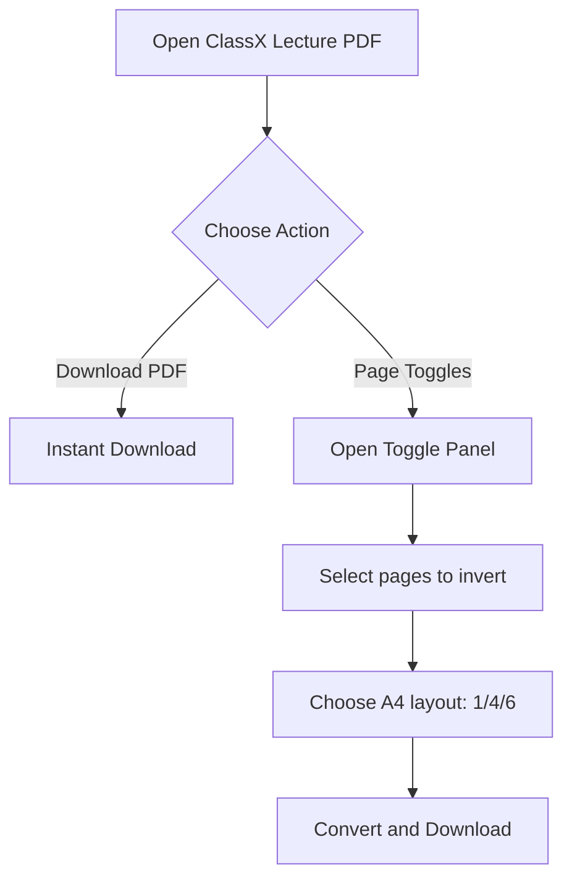

# ClassX PDF Downloader

A polished ClassX PDF helper extension for beginners.

<p align="left">
  <a href="https://vishalgupta.dev"></a>
  <a href="https://instagram.com/vishugupta.dev"></a>
  
</p>

---

## Why This Extension

ClassX often opens notes inside a PDF.js viewer URL. This extension gives one smooth workflow:

- Fast PDF download from ClassX pages
- Per-page invert toggle (dark note to white note style)
- A4 export layouts: 1-up, 4-up, 6-up
- Better size/quality balance for final converted PDF

---

## Quick Start (60 Seconds)

1. Open your browser extensions page:
- Brave: `brave://extensions`
- Chrome: `chrome://extensions`
- Edge: `edge://extensions`

2. Enable **Developer mode**.
3. Click **Load unpacked** and select this folder:

```text
classx-downloader
```

4. Open ClassX -> open any lecture PDF.
5. Use floating buttons on bottom-right:
- `Download PDF`
- `Page Toggles`

---

## Core Features

| Feature | What it does | Best for |
|---|---|---|
| Download PDF | Downloads the current opened ClassX PDF | Quick save |
| Page Toggles | Lets you pick pages to invert | Dark-board notes |
| A4 1-up | One source page per A4 page | Maximum readability |
| A4 4-up | Four source pages per A4 page | Compact notes |
| A4 6-up | Six source pages per A4 page | Minimum page count |

---

## Usage Flow



---

## Page Toggle Panel Guide

### Buttons
- `Auto`: Apply auto detection for dark pages
- `Select All`: Mark all pages for invert
- `Clear All`: Unmark all pages

### A4 Layout Selector
- `1 page per A4`: clear text, larger file
- `4 pages per A4`: balanced
- `6 pages per A4`: smallest output pages, smallest text

### Convert
- Click `Convert And Download PDF`
- Extension creates a new output PDF and starts download

---

## Project Structure

```text
classx-downloader/
|- manifest.json      # Extension metadata and permissions
|- content.js         # Floating UI + page toggle panel
|- background.js      # Frame detection + message handlers
|- viewer_tools.js    # PDF analysis + conversion engine
|- popup.html         # Extension popup UI
|- README.md
```

---

## Troubleshooting

<details>
<summary><b>Buttons are not visible</b></summary>

- Refresh the ClassX tab
- Confirm lecture PDF is open (not normal course list page)
- Reload extension from extensions page

</details>

<details>
<summary><b>Stuck on "Converting..."</b></summary>

- Wait for large files (multi-page processing takes time)
- Retry with fewer selected pages
- Try 4-up or 6-up for faster output
- Refresh page and retry if a session is stale

</details>

<details>
<summary><b>Output file size feels high</b></summary>

- Use 4-up or 6-up
- Convert only needed pages
- Prefer 4-up for best readability/size balance

</details>

<details>
<summary><b>Changes in code not reflecting</b></summary>

- Open extensions page
- Click **Reload** on this extension
- Refresh ClassX tab

</details>

---

## Privacy

- Conversion runs inside your browser session.
- No external conversion server is required.

---

## Credits

Built by **@vishuXdev**

- Portfolio: [vishalgupta.dev](https://vishalgupta.dev)
- Instagram: [instagram.com/@vishugupta.dev](https://instagram.com/vishugupta.dev)
